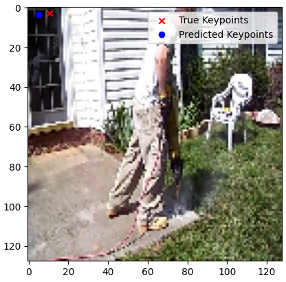

<h1>Pose Estimation using Keras in Python at IMSAR</h1>
 
<h2>Features</h2>
<ul>
    <li>Visualize images with keypoints</li>
    <li>Predict keypoints, MSE: 4.66</li>
    <li>Normalized images</li>
    <li>Deep Learning (BatchNormalization + Conv2D + MaxPooling2D + Dropout)</li>
    <li>Callbacks: Dynamic learning rate + early stopping</li>
    <li>Keypoints to .json file, best_mode.keras, model.weights.h5</li>
</ul>

 

<h2>Photo</h2>

 
<h2>Contact</h2>

<b> Email: mariusc0023@gmail.com </b>
